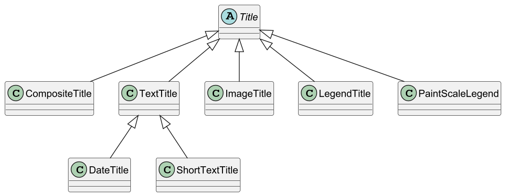

Proteomics chart library
==========

Overview
--------
pdk-chart is a chart library modified from JFreeChart. It adds features related to proteomics data visualization and fluent-style APIs.

pdk-chart requires JDK 25 or later.

For Developers
--------------

### Using pdk-chart
To use pdk-chart in your projects, add the following dependency to your build tool:

```xml
<dependency>
    <groupId>io.github.jiaweim</groupId>
    <artifactId>pdk-chart</artifactId>
    <version>2.10.0</version>
</dependency>
```

## Examples

### Scatter

```java
XYChart chart = JChart.scatter(
                new double[]{0, 1, 2, 3, 4},
                new double[]{0, 1, 4, 9, 16})
        .axisNames("x", "y");
chart.show();
```

### Line

- Basic Line Chart


### Bar


## Chart

### Title

`Chart` support setting one main title and multiple subtitles.

The class diagram of `Title` is shown below.



The main title is of the `TextTitle` type, while subtitles can be any subclass of `Title`. The chart's legend is also implemented as a subtitle.

#### Main title

Methods provided by `Chart` for setting main title:

```java
public void setTitle(TextTitle title);
public void setTitle(String text); // Convenient methods for the previous
```


## Plot

### Gridline

Grid lines fall into two types: 

- domain gridlines
- range gridlines

Domain grid lines run perpendicular to the domain axis, while range grid lines run perpendicular to the range axis.

Grid lines have three properties: 

- `visible`, whether to display grid lines
- `stroke`, `Stroke` used for rendering grid lines
- `paint`, `Paint` used to rendering grid lines

Methods provided by `XYPlot` for configuring grid lines:

```java
public void setDomainGridlinesVisible(boolean visible);
public void setDomainMinorGridlinesVisible(boolean visible);

public void setDomainGridlineStroke(Stroke stroke);
public void setDomainMinorGridlineStroke(Stroke stroke);

public void setDomainGridlinePaint(Paint paint);
public void setDomainMinorGridlinePaint(Paint paint);
```

The same methods are available for range grid line; simply replace "Domain" with "Range".

### Crosshair

